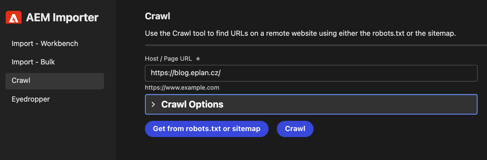
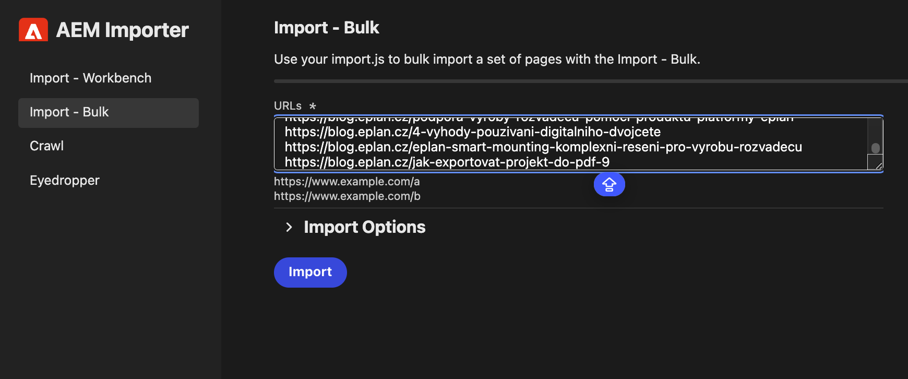
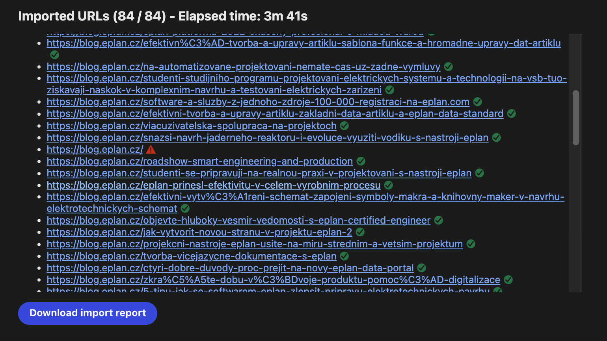

## Usage

At the root of an AEM project, simply run:

```
$ aem import
```

If you don't have aem cli, then please install it:
```
$ npm install -g @adobe/aem-cli
```

The `import` command clones the helix-import-ui repo for you.

## Step #1 - Download crawl report from a website
- Go to Crawl tab and add your link that will extract all urls of the website
- Click on "Download crawl report" - This will provide you excel file which will have all urls of the website.



## Step #2 - Import URLs from Excel file
- Go to "Import - Bulk" tab  and copy all urls from the excel file in the "URLS" field.
- Expand the import options and change the Transformation file URL either for importing authors to http://localhost:3001/tools/importer/authors.js or http://localhost:3001/tools/importer/articles.js for importing articles.
- Click on "Import" button - This will import all urls into your preferred folder. (There will be a prompt asking you which folder to import the urls in.)
- Wherever you pick to be downloaded, the folders for authors will be created into "author" and articles will be sorted into folders based on the category which is pulled from tags on the page. If there is no category articles will be downloaded in folder name "Uncategorized".

- Verify if all pages are downloaded by checking the imported URLs list. If you see any errors, please check the developer tools for more information. Ignore for example homepage when trying to download authors - there is no author on homepage so that is why.

